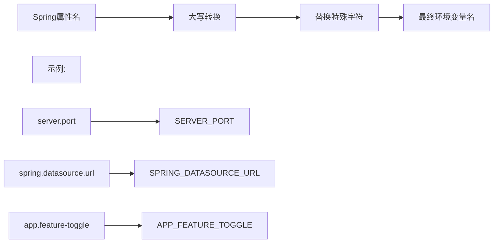

# 在 Docker Compose 中通过 .env 文件加载变量：完整指南

## 引言
在 Docker Compose 中，`.env` 文件是管理环境变量的核心工具。它能实现**配置与代码分离**，让您轻松管理不同环境（开发、测试、生产）的设置。本文将深入探讨如何高效使用 `.env` 文件，包括变量加载顺序、命名规范以及与 Spring Boot 应用的集成。

---

## 一、.env 文件基础
### 1. 文件位置与加载规则
- **默认位置**：Docker Compose 自动加载**同级目录**下的 `.env` 文件
- **手动指定**：`docker-compose --env-file path/to/custom.env up`
- **文件示例**：
  
  ```ini
  # .env
  DB_HOST=mysql-container
  DB_PORT=3306
  SPRING_PROFILES_ACTIVE=dev
  APP_VERSION=1.5.0
  ```

### 2. 变量名格式要求
| 类型         | 合法示例    | 非法示例    | 原因                 |
| ------------ | ----------- | ----------- | -------------------- |
| **基础命名** | `API_KEY`   | `api-key`   | 连字符不允许         |
| **包含数字** | `DB_USER1`  | `1DB_USER`  | 不能以数字开头       |
| **大小写**   | `app_port`  | 无限制      | 大小写敏感           |
| **特殊字符** | `S3_BUCKET` | `S3@BUCKET` | 仅支持字母数字下划线 |

> 💡 最佳实践：**全大写+下划线**命名（如 `MAX_CONNECTIONS`），提高可读性

---

## 二、环境变量加载顺序与优先级
Docker Compose 加载变量的顺序决定了最终生效值：

### 加载顺序（从低到高）
1. `.env` 文件中的变量（基础值）
2. `environment` 中的**静态值**（直接赋值）
3. `environment` 中的**插值变量**（`${VAR}`）
4. 命令行传递的变量（`-e VAR=value`）

### 优先级（从高到低）


### 实际示例
```yaml
# docker-compose.yml
services:
  app:
    environment:
      DB_HOST: "localhost"         # 静态值
      DB_PORT: "${COMPOSE_DB_PORT}" # 插值变量
```

```ini
# .env
COMPOSE_DB_PORT=3306
DB_HOST=mysql-prod
```

**最终值**：
- `DB_HOST = "localhost"`（静态值优先于 .env）
- `DB_PORT = 3306`（来自 .env 的 `COMPOSE_DB_PORT`）

> 验证命令：`docker-compose run app env | grep DB_`

---

## 三、environment 配置详解
### 1. 基本语法
```yaml
environment:
  - VAR_NAME=value          # 直接赋值
  - "EXPLICIT_STRING=value" # 显式字符串
  - DYNAMIC_VAR=${ENV_VAR}  # 引用.env变量
```

### 2. 特殊值处理技巧
| 场景         | 示例                               | 说明                  |
| ------------ | ---------------------------------- | --------------------- |
| **包含空格** | `GREETING="Hello World"`           | 必须用引号包裹        |
| **包含等号** | `CONFIG="key=value"`               | 引号防止解析错误      |
| **多行值**   | `CERT="-----BEGIN CERT-----\n..."` | 使用 `\n` 换行符      |
| **布尔值**   | `FEATURE_ENABLED=true`             | Spring 会自动转换类型 |

---

## 四、与 Spring Boot 的变量映射
Spring Boot 自动将环境变量转换为配置属性，规则如下：

### 命名转换规则


### 常用 Spring 变量映射表
| Spring 配置项            | Docker 环境变量名        | 类型   | 默认值  |
| ------------------------ | ------------------------ | ------ | ------- |
| `server.port`            | `SERVER_PORT`            | int    | 8080    |
| `spring.datasource.url`  | `SPRING_DATASOURCE_URL`  | string | -       |
| `spring.profiles.active` | `SPRING_PROFILES_ACTIVE` | string | default |
| `logging.level.root`     | `LOGGING_LEVEL_ROOT`     | string | INFO    |

### 完整示例
```yaml
# docker-compose.yml
services:
  spring-app:
    image: my-spring-app:latest
    environment:
      SPRING_PROFILES_ACTIVE: "prod"
      SPRING_DATASOURCE_URL: "jdbc:mysql://${DB_HOST}:${DB_PORT}/appdb"
      SERVER_PORT: "8080"
      APP_API_KEY: "${SECRET_API_KEY}" # 来自.env
```

```ini
# .env
DB_HOST=mysql-primary
DB_PORT=3306
SECRET_API_KEY=abc123xyz
```

---

## 五、多环境管理策略
### 1. 环境特定 .env 文件
```
├── .env.dev       # 开发环境
├── .env.staging   # 预发布
├── .env.prod      # 生产环境
└── docker-compose.yml
```

启动命令：
```bash
# 开发环境
docker-compose --env-file .env.dev up

# 生产环境
docker-compose --env-file .env.prod up
```

### 2. 组合 Compose 文件
```bash
# 基础服务 + 环境覆盖  注意后面的docker-compose会覆盖前面的配置项，最终是多个docker-compose文件的合并
docker-compose -f docker-compose.yml -f docker-compose-prod.yml up
```

```yaml
# docker-compose-prod.yml
services:
  spring-app:
    environment:
      SPRING_PROFILES_ACTIVE: "prod"
      SPRING_DATASOURCE_URL: "jdbc:mysql://prod-db:3306/prod_db"
```

---

## 六、安全最佳实践
1. **禁止版本控制**：
   ```gitignore
   # .gitignore
   .env
   *.secret
   ```

2. **文件权限控制**：
   ```bash
   chmod 600 .env  # 仅允许所有者读写
   ```

3. **生产环境加密**：
   ```bash
   # 使用ansible-vault加密
   ansible-vault encrypt .env.prod
   
   # 启动时解密
   ansible-vault view --vault-password-file=key.txt .env.prod | docker-compose --env-file /dev/stdin up
   ```

4. **敏感变量特殊处理**：
   ```yaml
   # 避免在.env中存储真实密码
   environment:
     DB_PASSWORD_FILE: /run/secrets/db_pass
   secrets:
     db_pass:
       file: ./db_password.txt
   ```

---

## 七、常见问题解决
**问题1：变量未生效**
- 检查 `.env` 文件路径是否正确
- 验证变量名大小写是否匹配（`db_host` ≠ `DB_HOST`）
- 运行 `docker-compose config` 查看解析结果

**问题2：Spring 无法解析变量**
- 确认环境变量名遵循 `PROPERTY_NAME` 格式
- 在 Spring 添加调试：
  ```yaml
  # application.yml
  logging:
    level:
      org.springframework.core.env: DEBUG
  ```

**问题3：特殊字符解析错误**
```yaml
# 错误
environment:
  JSON_CONFIG: {"key":"value"}

# 修复
environment:
  JSON_CONFIG: '{"key":"value"}'  # 单引号包裹
```

---

## 结语
通过合理使用 `.env` 文件和 Docker Compose 的 `environment` 配置，您可以实现：
1. **配置与代码分离** - 安全管理敏感信息
2. **环境一致性** - 开发/测试/生产环境无缝切换
3. **Spring Boot 无缝集成** - 自动转换环境变量

> **终极实践建议**：开发环境使用 `.env` 快速配置，生产环境升级到 Docker Secrets 或云平台密钥管理服务（如 AWS Secrets Manager）。